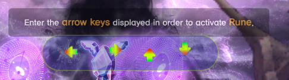

https://discord.gg/8NndFGpeYp
Join the discord server to get started!

Looking to level up in Maplestory even while away from your PC? Want to reach Talahart quickly? Dream of racking up mesos without lifting a finger? Aiming for Lvl 300? We've got you covered!

## Latest Update
- Len/Ren Supported!

## Features
- **Auto Farm**: Farm up to 270+ mobs/min without triggering LD (mob count varies by class and settings). (On default spawn rate)
- **Rune Solver**: Handles ALL rune arrow colors, Purple/Blue/Red ALL SOLVABLE

- **Auto Care**: Takes care of pet feeding and potion usage.
- **Auto Revive**: Ensures your character stays alive.
- **Map Versatility**: Works on all maps with customizable bounds.
- **Easy Control**: Manage it via a desktop app or Telegram bot.
- **Auto Potion**: Automatically replenishes your character's HP or MP when they're running low.
- **Panic Mode**: Goes to Town/Auto CC if someone enters your map.

### Telegram Bot Controls
- Start/Pause/Stop
- Town
- Status Check: Get screenshots of your character.
- Messaging: Have your character type out messages.
- Alerts: Notifications for LD and other player's presence.
- CC: Automatically find the next available CC.
- Enable/Disable Consumables: Enable or Disabled consumables to be used on the fly.

## 📚 FAQs 📚
- **Not a AHK bot**

**Q**: How does it work?
**A**: Bot is fully external, no memory reads, no injections, no hooks to the game. Works by taking screenshot and pressing your keyboard.

**Q**: What happens when there's a game update?  
**A**: Since our bot doesn't interact with the game files, it won't be affected by game updates.

**Q**: Can I run the bot on more than one PC?  
**A**: Indeed! You're free to use the bot across multiple PCs, but not simultaneously on different systems. If interested in multi-PC usage at the same time, please highlight this when creating a ticket at get-started. We're here to assist!

**Q**: Does it work for XYZ Server?  
**A**: Currently tested servers are: KMS, MSEA, JMS, and should work on all private servers with 5th job update

https://discord.gg/8NndFGpeYp
Join the discord server to get started!
