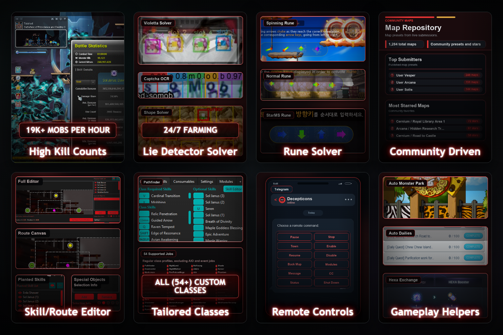
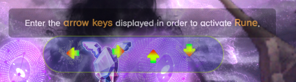

[[https://discord.gg/8NndFGpeYp
Join the discord server to get started!

Looking to level up in Maplestory even while away from your PC? Want to reach Greadrock quickly? Dream of racking up mesos without lifting a finger? Aiming for Lvl 300? We've got you covered!

## Latest Update
- LD Solver
- Len/Ren + MoXuan + Lynn Supported
- Remaster Classes (Kanna/Hayato/WildHunter/Kinesis)
- Auto Monster Park
- Auto Dailies

## Features

- **Auto Farm**: Farm up to 280+ mobs/min without triggering LD (mob count varies by class and settings). (On default spawn rate)
- **LD Solver**: Solves Violetta, Captcha, Shape LD (Coming soon) for 24/7 uptime farming
- **Auto Dailies**: Run daily areas and return to your selected map.
- **Monster Park**: Enter, clear, exit, and return from Monster Park.
- **Rune Solver**: Handles ALL rune arrow colors. Purple/Blue/Red ALL SOLVABLE

- **Spinning Rune Solver**: Even spinning ones.
- **Scheduled Clicker**: Record short click/key routines and replay them on a schedule.
- **Auto Care**: Takes care of pet feeding and potion usage.
- **Auto Revive**: Ensures your character stays alive.
- **Map Versatility**: Works on all maps with customizable bounds.
- **Easy Control**: Manage it via a desktop app or Telegram bot.
- **Auto Potion**: Automatically replenishes your character's HP or MP when they're running low.
- **Panic Mode**: Goes to Town/Auto CC if someone enters your map.
- **Editor**: Choose where you want your character to go, and where you want to cast skills.

### Community Driven
- Map presets and repository support
- Save & load farming presets instantly
- Community farming presets
- Continuous map and setup improvements

### Telegram Bot Controls
- Start/Pause/Stop
- Town
- Status Check: Get screenshots of your character.
- Messaging: Have your character type out messages.
- Alerts: Notifications for LD and other player's presence.
- CC: Automatically find the next available CC.
- Enable/Disable Consumables: Enable or Disabled consumables to be used on the fly.
- Auto Dailies: Start daily helper flow remotely.
- Monster Park: Start Monster Park from town and return to your farming map.

## 📚 FAQs 📚
- **Not a AHK bot**

**Q**: How does it work?
**A**: Bot is fully external, no memory reads, no injections, no hooks to the game. Works by taking screenshot and pressing your keyboard.

**Q**: What happens when there's a game update?  
**A**: Since our bot doesn't interact with the game files, it won't be affected by game updates.

**Q**: Can I run the bot on more than one PC?  
**A**: Indeed! You're free to use the bot across multiple PCs, but not simultaneously on different systems. If interested in multi-PC usage at the same time, please highlight this when creating a ticket at get-started. We're here to assist!

**Q**: Does it work for XYZ Server?  
**A**: Currently tested servers are: KMS, MSEA, JMS, and should work on all private servers with 5th job update, works with GeForce Now if you play GMS

https://discord.gg/8NndFGpeYp
Join the discord server to get started!
](https://discord.gg/8NndFGpeYp  
Join the discord server to get started!

Looking to level up in Maplestory even while away from your PC? Want to reach Greadrock quickly? Dream of racking up mesos without lifting a finger? Aiming for Lvl 300? We've got you covered!

## Latest Update
- Len/Ren + MoXuan + Lynn Supported
- Remaster Classes (Kanna/Hayato/WildHunter/Kinesis)
- Auto Monster Park
- Auto Dailies

## Features

### High Kill Counts
- Smart farming built for virtually every map
- Up to **280+ mobs/min** on Grandis maps*
- Supports **all maps**
- Custom movement bounds & farming styles
- CD Reduction Support

*Rates vary depending on class, setup, and map.*

### LD Solver
- Farm 24/7
- Captcha LD
- Violetta LD
- Shape LD *(Coming soon)*

### Advanced Rune Support
- Every rune type
- Solves **all rune types**
- Supports **Spinning Runes**
- Supports **Star MS Runes**
- Designed to avoid triggering unnecessary mechanics

### Community Driven
- Map presets and repository support
- Map Repository support
- Save & load farming presets instantly
- Community farming presets
- Continuous map and setup improvements

### Skill / Route Editor
- Fully customizable farming routes
- Skill Editor with custom rotations
- Custom movement bounds
- Custom farming styles
- Save & load farming presets instantly

### Tailored Classes
- All (54+) custom classes
- Latest class revamps supported
- Class-specific farming logic
- Custom rotations per class
- Continuous optimizations for new classes

### Telegram Remote Control
- Control your bot from anywhere directly through Telegram
- Start / Pause / Stop
- Auto CC Commands
- Town Commands
- Live Screenshots
- Status Monitoring
- Character Messaging
- Real-time Alerts & Notifications

### Automation & QOL
- Fully hands-off experience
- Auto Monster Park
- Auto Dailies
- Auto Claim Rewards
- Auto Potion / Auto Care
- Auto Revive
- Auto Pet Feed
- Auto Consumables
- Auto TP back to farming map

### Safety Systems
- Ban prevention and recovery tools
- Auto CC when players enter map
- Panic Mode
- White Room Detection
- LD Detection & Alerts
- GM / Player Chat Detection
- Crash & Disconnect Detection

### Constantly Updated
- Active development since **2023**
- Latest class revamps supported
- Updated for new UI & mechanics
- Continuous optimizations & new features

## FAQs

- **Not an AHK bot**

**Q**: How does it work?  
**A**: Bot is fully external, no memory reads, no injections, no hooks to the game. Works by taking screenshot and pressing your keyboard.

**Q**: What happens when there's a game update?  
**A**: Since our bot doesn't interact with the game files, it won't be affected by game updates.

**Q**: Can I run the bot on more than one PC?  
**A**: Indeed! You're free to use the bot across multiple PCs, but not simultaneously on different systems. If interested in multi-PC usage at the same time, please highlight this when creating a ticket at get-started. We're here to assist!

**Q**: Does it work for XYZ Server?  
**A**: Currently tested servers are: KMS, MSEA, JMS, and should work on all private servers with 5th job update, works with GeForce Now if you play GMS.

https://discord.gg/8NndFGpeYp  
Join the discord server to get started!)](https://discord.gg/8NndFGpeYp  
Join the discord server to get started!

Looking to level up in Maplestory even while away from your PC? Want to reach Greadrock quickly? Dream of racking up mesos without lifting a finger? Aiming for Lvl 300? We've got you covered!

## Latest Update
- Len/Ren + MoXuan + Lynn Supported
- Remaster Classes (Kanna/Hayato/WildHunter/Kinesis)
- Auto Monster Park
- Auto Dailies

## Features

### High Kill Counts
- Smart farming built for virtually every map
- Up to **280+ mobs/min** on Grandis maps*
- Supports **all maps**
- Custom movement bounds & farming styles
- CD Reduction Support

*Rates vary depending on class, setup, and map.*

### LD Solver
- Farm 24/7
- Captcha LD
- Violetta LD
- Shape LD *(Coming soon)*

### Advanced Rune Support
- Every rune type
- Solves **all rune types**
- Supports **Spinning Runes**
- Supports **Star MS Runes**
- Designed to avoid triggering unnecessary mechanics

### Community Driven
- Map presets and repository support
- Map Repository support
- Save & load farming presets instantly
- Community farming presets
- Continuous map and setup improvements

### Skill / Route Editor
- Fully customizable farming routes
- Skill Editor with custom rotations
- Custom movement bounds
- Custom farming styles
- Save & load farming presets instantly

### Tailored Classes
- All (54+) custom classes
- Latest class revamps supported
- Class-specific farming logic
- Custom rotations per class
- Continuous optimizations for new classes

### Telegram Remote Control
- Control your bot from anywhere directly through Telegram
- Start / Pause / Stop
- Auto CC Commands
- Town Commands
- Live Screenshots
- Status Monitoring
- Character Messaging
- Real-time Alerts & Notifications

### Automation & QOL
- Fully hands-off experience
- Auto Monster Park
- Auto Dailies
- Auto Claim Rewards
- Auto Potion / Auto Care
- Auto Revive
- Auto Pet Feed
- Auto Consumables
- Auto TP back to farming map

### Safety Systems
- Ban prevention and recovery tools
- Auto CC when players enter map
- Panic Mode
- White Room Detection
- LD Detection & Alerts
- GM / Player Chat Detection
- Crash & Disconnect Detection

### Constantly Updated
- Active development since **2023**
- Latest class revamps supported
- Updated for new UI & mechanics
- Continuous optimizations & new features

## FAQs

- **Not an AHK bot**

**Q**: How does it work?  
**A**: Bot is fully external, no memory reads, no injections, no hooks to the game. Works by taking screenshot and pressing your keyboard.

**Q**: What happens when there's a game update?  
**A**: Since our bot doesn't interact with the game files, it won't be affected by game updates.

**Q**: Can I run the bot on more than one PC?  
**A**: Indeed! You're free to use the bot across multiple PCs, but not simultaneously on different systems. If interested in multi-PC usage at the same time, please highlight this when creating a ticket at get-started. We're here to assist!

**Q**: Does it work for XYZ Server?  
**A**: Currently tested servers are: KMS, MSEA, JMS, and should work on all private servers with 5th job update, works with GeForce Now if you play GMS.

https://discord.gg/8NndFGpeYp  
Join the discord server to get started!)
